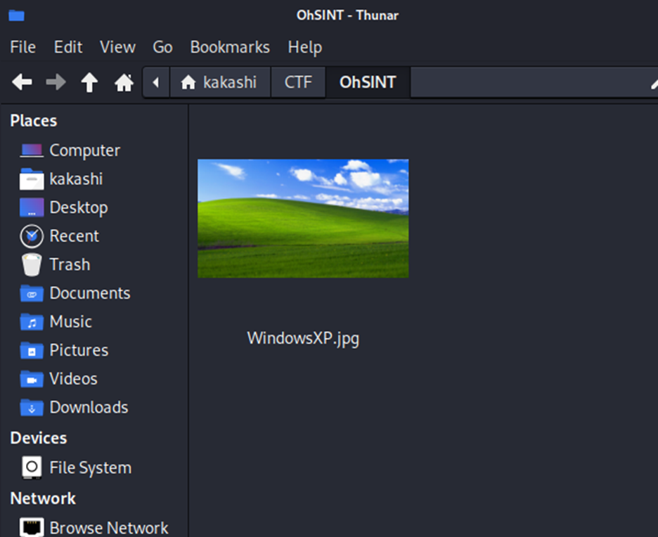
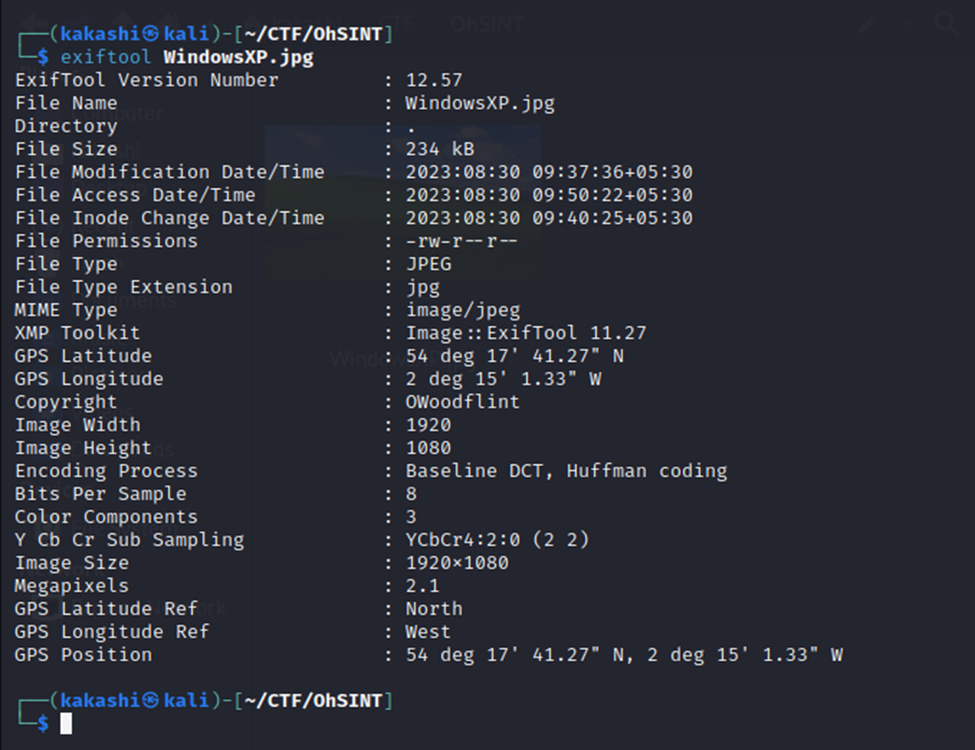
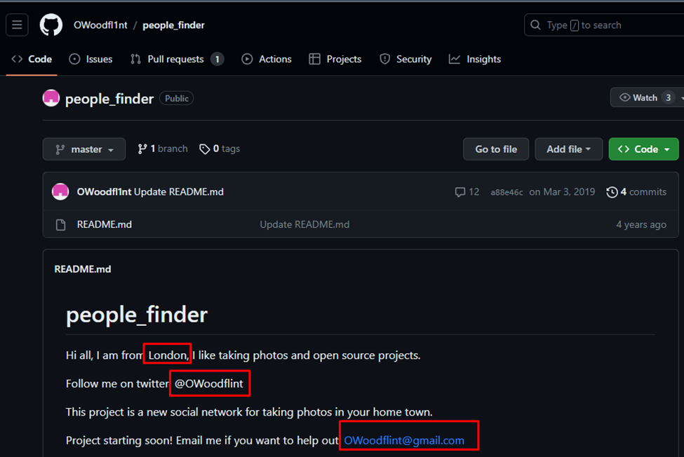
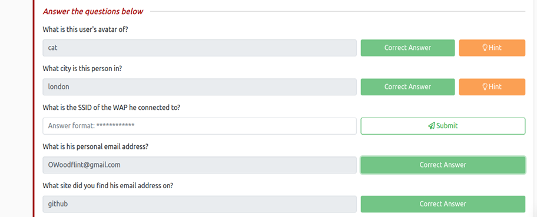
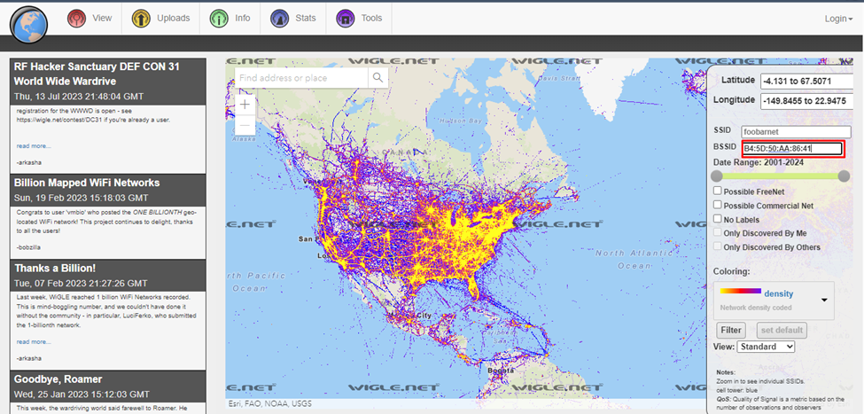
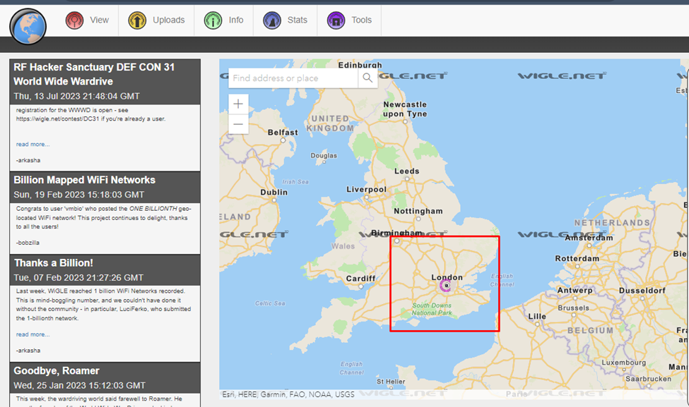
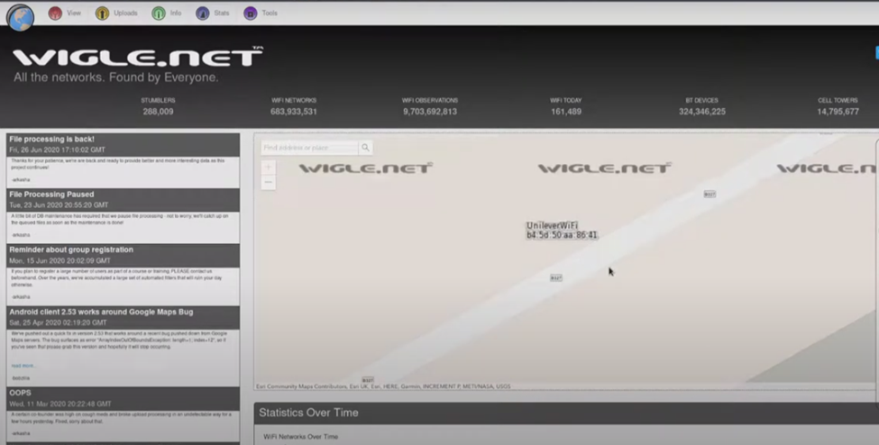
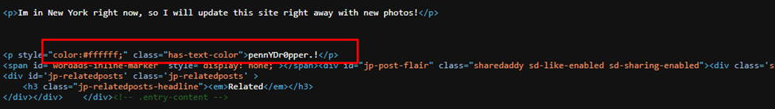

CTF Writeups

TRY HACK ME

OhSINT

OSINT abbreviates Open Source INTelligence which is gathering information found in the internet, In this CTF they have provided a image file we need to extract information from it.

  

From  this Image we need to extract Information that is we need to extract the metadata from it.

What is metadata?

Metadata in images refers to the additional information embedded within the image file. This information provides details about the image, such as the camera settings (exposure, aperture, ISO), date and time the photo was taken, location coordinates, and sometimes even the camera model. Other metadata can include the photographer's name, copyright information, keywords, and descriptions. This data is useful for organizing, managing, and retrieving images, as well as for providing context and attributing credit to the image.

To Extract the metadata from the image we are gonna use exiftool.

While Analyzing the Images metadata we gathered the following Information:

 

From the Above Details, We found something Interesting Copyright: Owoodflint
Try Google Search Owoodflint and see whether any useful information can be obtained.

We found a twitter account With the same username Owoodflint
 
 

While Surfing Online we even found a github repository with the same username there we found some sensitive information about the person
His location
His Gmail ID 

 

From the Above Two Images we able to answer some of the Questions in the OhSINT Room:

 

To Find the SSID of the WAP he connected to We can use the information from his twiiter account where he mentioned his SSID of his WIFI:
To find Location from the SSID we can use the wigle Geo Locator Website.
 
 

 

 

We found a blog website with the same username, Lets inspect the blog website.

From the Blog we found his Vacation location, To find his password let inspect the page source.

While Inspecting the page source we found something fishy a text with the white color which is not visible in the website, it could possibly be his password.
 

We have completed the room.
